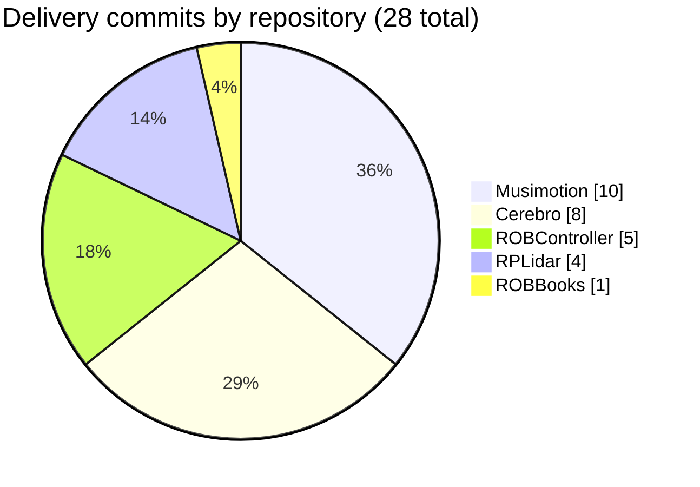
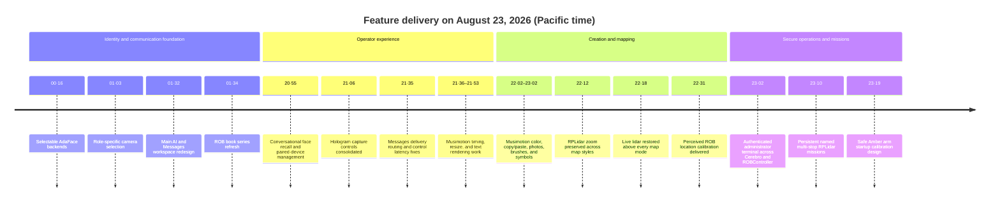
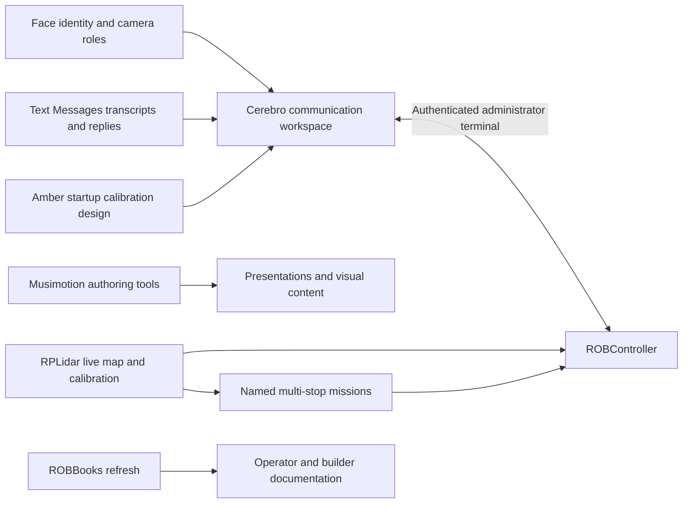

# RudyAramayo Delivery Summary — August 23, 2026

## Executive summary

This report covers every Git repository directly under `/Users/rob/dev` whose
`origin` remote belongs to `github.com/RudyAramayo`. The delivery timeline is
scoped to commits dated August 23, 2026 (Pacific time) and reachable from each
repository's checked-out branch.

- **9 owned repositories audited**
- **5 repositories changed**
- **28 feature and documentation commits delivered**
- **4 repositories unchanged during the delivery window**
- **110 files changed**, with **12,381 insertions** and **1,113 deletions**
  across the five changed repositories

The report-publication commit containing this document is intentionally not
included in those delivery totals.

## Repository coverage

| Local folder | GitHub repository | Branch | Aug. 23 commits | Delivery footprint | Snapshot state |
|---|---|---:|---:|---:|---|
| `Cerebro` | `RudyAramayo/Cerebro` | `Gemini-Workspace` | 8 | 50 files, +5,231 / −490 | Commits pushed; working tree had later local edits |
| `M2M1-RPLIDAR-iOS-MacOS-Catalyst-` | `RudyAramayo/M2M1-RPLIDAR-iOS-MacOS-Catalyst-` | `master` | 4 | 5 files, +847 / −35 | Pushed and clean |
| `ROBController` | `RudyAramayo/ROBController` | `main` | 5 | 11 files, +1,799 / −15 | Commits pushed; working tree had later local edits |
| `git.musimotion` | `RudyAramayo/Musimotion` | `main` | 10 | 15 files, +3,731 / −402 | Pushed and clean |
| `Presentation` | `RudyAramayo/ROBBooks` | `main` | 1 | 29 files, +773 / −171 | Pushed and clean before this report |
| `Amber-HomeFolder` | `RudyAramayo/Amber-HomeFolder` | `main` | 0 | — | Unchanged, pushed and clean |
| `ROBArduino` | `RudyAramayo/ROBArduino` | `main` | 0 | — | Unchanged, pushed and clean |
| `ROBControllerVision` | `RudyAramayo/ROBControllerVision` | `main` | 0 | — | Unchanged on Aug. 23; three earlier local commits were not yet pushed |
| `ROBTrainingGames` | `RudyAramayo/ROBTrainingGames` | `main` | 0 | — | Unchanged, pushed and clean |

## Delivery timeline

## How the delivered systems connect

The paired implementation is deliberate: RPLidar owns sensing and local map
planning, ROBController owns operator authorization, and Cerebro remains the
policy and coordination boundary. Mission stops therefore reuse the existing
destination authorization path instead of silently commanding motion.

## Commit summary by repository

### Cerebro — 8 commits

| Time | Commit | Change | Delivered result |
|---:|---|---|---|
| 00:16 | [`e76d515`](https://github.com/RudyAramayo/Cerebro/commit/e76d515) | Selectable AdaFace recognition backends | Added official IR-18 VGGFace2/WebFace4M model choices, persistent model selection, versioned encrypted embeddings, cosine matching, conversion tooling, validation, and operator documentation. |
| 01:03 | [`4b9a213`](https://github.com/RudyAramayo/Cerebro/commit/4b9a213) | Role-specific AVFoundation camera selectors | Let operators assign cameras by role, including the main and belly capture surfaces, with regression coverage for selection behavior. |
| 01:32 | [`4efc2fe`](https://github.com/RudyAramayo/Cerebro/commit/4efc2fe) | Main communication workspace redesign | Combined the primary AI transcript with a full Messages workspace: conversation table, detailed transcript, archived replies, and inline response composer in one resizable window. |
| 20:55 | [`6252a65`](https://github.com/RudyAramayo/Cerebro/commit/6252a65) | Conversational face recall and paired-device management | Connected recognized identity to conversation policy and scene context, while adding paired control-device administration and protocol coverage. |
| 21:06 | [`19d5ec1`](https://github.com/RudyAramayo/Cerebro/commit/19d5ec1) | Hologram controls consolidated in camera capture | Moved hologram capture/export operations into the camera workflow and removed fragmented entry points. |
| 21:35 | [`f870f60`](https://github.com/RudyAramayo/Cerebro/commit/f870f60) | Messages reply and responsiveness fixes | Resolved replies through the originating chat's native account aliases, prevented changed-route sends, added searchable transcript details and delivery state, and reduced vision/tread control latency. |
| 23:02 | [`5c70e6e`](https://github.com/RudyAramayo/Cerebro/commit/5c70e6e) | Authenticated administrator terminal host | Added the Cerebro-side terminal service with authenticated protocol handling, security constraints, fixtures, and operational documentation. |
| 23:19 | [`b8bdb72`](https://github.com/RudyAramayo/Cerebro/commit/b8bdb72) | Safe Amber arm startup calibration design | Documented a staged, fail-safe wake-up and calibration sequence for Amber's arms, including operator gates and recovery behavior. |

### M2M1-RPLIDAR-iOS-MacOS-Catalyst- — 4 commits

| Time | Commit | Change | Delivered result |
|---:|---|---|---|
| 22:12 | [`bdef69d`](https://github.com/RudyAramayo/M2M1-RPLIDAR-iOS-MacOS-Catalyst-/commit/bdef69d) | Preserve zoom across map styles | Navigation, Terrain, and Satellite changes retain the exact camera and allow MapKit's closest supported zoom. |
| 22:18 | [`76e0978`](https://github.com/RudyAramayo/M2M1-RPLIDAR-iOS-MacOS-Catalyst-/commit/76e0978) | Keep live lidar visible | Restored the live scan and occupancy overlay above every base-map renderer, with a map-center fallback when GPS is unavailable. |
| 22:31 | [`ba6c54b`](https://github.com/RudyAramayo/M2M1-RPLIDAR-iOS-MacOS-Catalyst-/commit/ba6c54b) | Perceived-location calibration | Added long-press placement, map-center alignment, GPS reset, and persisted east/north offsets so lidar can match ROB's observed position. |
| 23:10 | [`4b95591`](https://github.com/RudyAramayo/M2M1-RPLIDAR-iOS-MacOS-Catalyst-/commit/4b95591) | Persistent mission paths | Stopped single destination taps from changing zoom and added named, persisted paths with numbered stops, route lines, edit/reverse/delete tools, and individual stop selection. |

### ROBController — 5 commits

| Time | Commit | Change | Delivered result |
|---:|---|---|---|
| 22:12 | [`87a3549`](https://github.com/RudyAramayo/ROBController/commit/87a3549) | Preserve zoom across map styles | Mirrored exact camera retention and maximum close zoom in ROBController's operational map. |
| 22:18 | [`053a906`](https://github.com/RudyAramayo/ROBController/commit/053a906) | Keep live lidar visible | Kept lidar returns and occupancy imagery above Navigation, Terrain, and Satellite, including operation before a GPS fix. |
| 22:31 | [`3f36c2e`](https://github.com/RudyAramayo/ROBController/commit/3f36c2e) | Perceived-location calibration | Added persistent manual map registration for ROB, map-center alignment, and restoration to device GPS. |
| 23:02 | [`0bbb1b2`](https://github.com/RudyAramayo/ROBController/commit/0bbb1b2) | Administrator terminal console | Added the authenticated controller-side terminal UI, shared protocol messages, package integration, fixtures, and operator documentation. |
| 23:10 | [`2aa7dd0`](https://github.com/RudyAramayo/ROBController/commit/2aa7dd0) | Persistent mission paths | Mirrored named multi-stop planning and camera-preserving taps; selecting a stop still enters the existing navigation authorization and Cerebro safety flow. |

### Musimotion — 10 commits

| Time | Commit | Change | Delivered result |
|---:|---|---|---|
| 21:36 | [`cf17555`](https://github.com/RudyAramayo/Musimotion/commit/cf17555) | Editable timeline duration | Made presentation duration operator-editable and kept the editor model and timing tests synchronized. |
| 21:47 | [`50f1512`](https://github.com/RudyAramayo/Musimotion/commit/50f1512) | Radial gestures and freeform resizing | Fixed gesture competition in radial menus and propagated freeform layer size through editing, playback, export, and visionOS presentation. |
| 21:53 | [`7bf80ef`](https://github.com/RudyAramayo/Musimotion/commit/7bf80ef) | Full text before layer scaling | Rendered the complete text layout before applying visual layer scale, preventing truncation during resizing. |
| 22:02 | [`aa368ed`](https://github.com/RudyAramayo/Musimotion/commit/aa368ed) | Inline radial color wheel | Restored immediate color editing within the radial menu and covered the interaction with UI tests. |
| 22:14 | [`2e3efac`](https://github.com/RudyAramayo/Musimotion/commit/2e3efac) | Radial copy and paste | Added reusable layer copy/paste actions backed by editor state and core/UI regression tests. |
| 22:28 | [`bfb4418`](https://github.com/RudyAramayo/Musimotion/commit/bfb4418) | Draggable photo library | Added an in-editor photo source whose images can be dragged directly onto the composition workspace. |
| 22:33 | [`81f9bea`](https://github.com/RudyAramayo/Musimotion/commit/81f9bea) | Background color menu | Enabled presentation background-color editing and persistence with model and UI coverage. |
| 22:43 | [`dc07ebb`](https://github.com/RudyAramayo/Musimotion/commit/dc07ebb) | Centered timeline transport | Restored the original centered playback/transport arrangement without losing the newer timing features. |
| 22:50 | [`32261a0`](https://github.com/RudyAramayo/Musimotion/commit/32261a0) | Live and raster brush tools | Restored drawing tools across editor state, rendering, export, immersive playback, and tests. |
| 23:02 | [`4c8cd22`](https://github.com/RudyAramayo/Musimotion/commit/4c8cd22) | Complete SF Symbols catalog | Added categorized SF Symbols resources and a full shape browser with project-generation and test integration. |

### ROBBooks (`Presentation`) — 1 commit

| Time | Commit | Change | Delivered result |
|---:|---|---|---|
| 01:34 | [`b2f1854`](https://github.com/RudyAramayo/ROBBooks/commit/b2f1854) | Book series refresh | Updated source snapshots, editorial/safety reviews, open-source maps, engineering volumes, generated PDFs, and contact-sheet previews for the latest ROB capabilities. |

## Delivered feature families

| Feature family | Repositories | Result |
|---|---|---|
| AI identity and perception | Cerebro | Selectable recognition models, encrypted/versioned face profiles, identity-aware conversation context, and camera-role selection. |
| Unified human communication | Cerebro | Main AI and text conversations are visible together; text replies use the original Messages route and expose delivery state. |
| Secure administration | Cerebro + ROBController | Authenticated administrator terminal transport and console with protocol/security regression coverage. |
| Lidar map usability | RPLidar + ROBController | Maximum zoom is stable, lidar stays visible, and perceived location can be calibrated without losing GPS reset capability. |
| Mission planning | RPLidar + ROBController | Multiple named waypoint paths persist locally, render as numbered routes, and feed stops into existing authorization controls. |
| Creative authoring | Musimotion | Timing, resizing, text, color, copy/paste, photo, brush, transport, and SF Symbols workflows were completed or restored. |
| Documentation and safety | ROBBooks + Cerebro | Current system capabilities were propagated into books, PDFs, reviews, and Amber startup-calibration guidance. |

## Verification and operational result

- The RPLidar and ROBController mission-map deliveries passed their static map
  regression suites and full Xcode builds after the final changes.
- Feature commits added or updated focused fixtures and UI/static regression
  tests across face identity, camera selection, Messages routing, administrator
  terminal security, map behavior, and Musimotion editor workflows.
- Every August 23 feature commit listed above was reachable from its current
  branch and synchronized with its configured GitHub upstream at the audit
  snapshot.
- Uncommitted working-tree edits and ROBControllerVision's three earlier local
  commits were not counted as delivered work and were not modified by this
  report.
