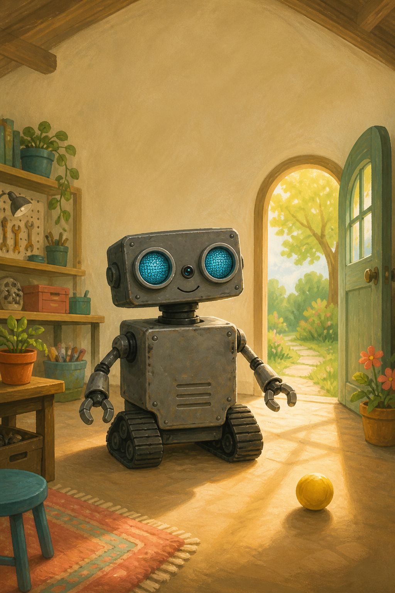
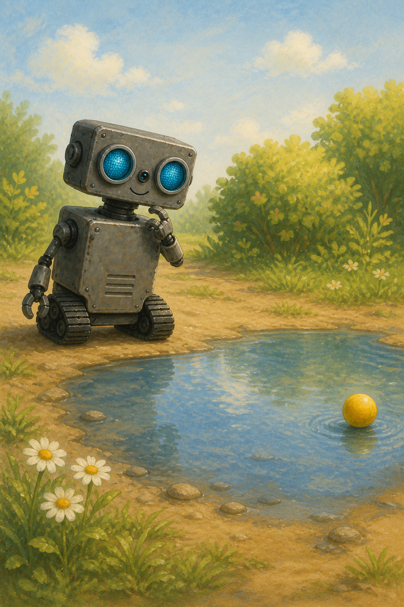
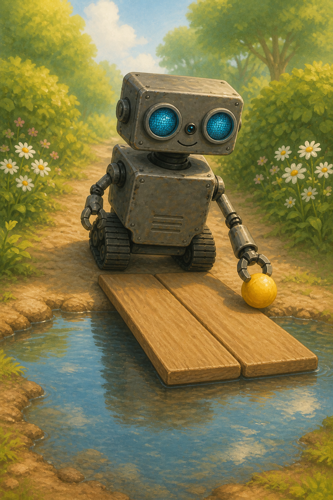
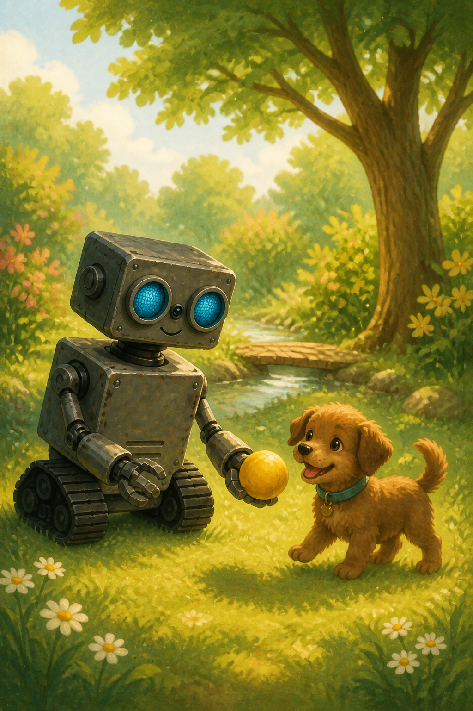
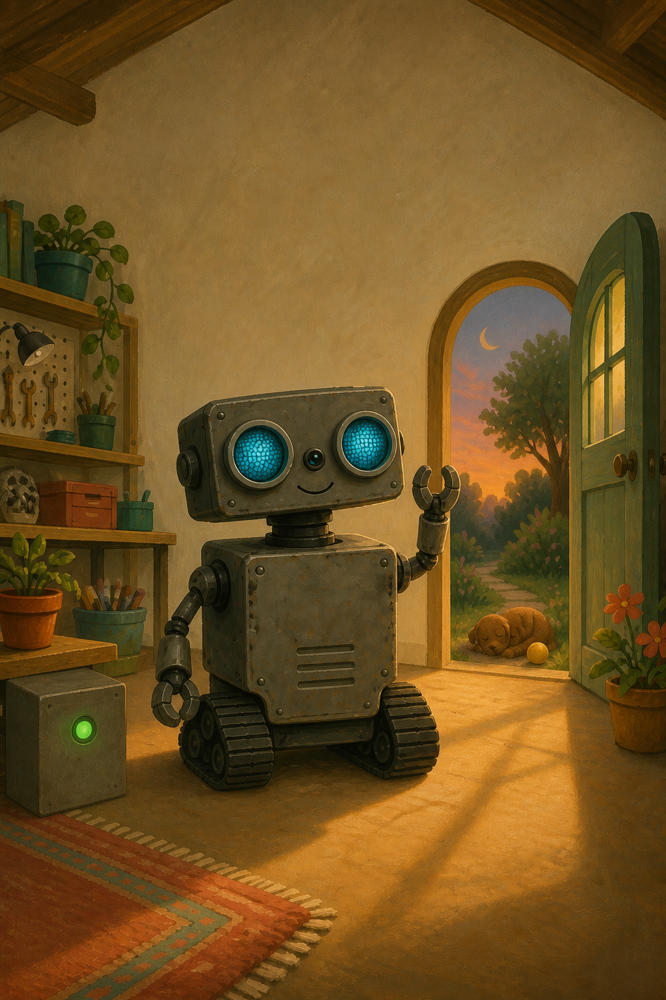

# ROB and the Lost Yellow Ball

## A note for grown-ups

This is an imaginary story inspired by the real ROB. The pictures are gentle illustrations, not build plans.

Read slowly. Let your child point, predict, count, and make ROB's sounds. Ask, “What should ROB do next?”

The repeating idea is simple:

**STOP · LOOK · THINK · CHOOSE · CHECK**

ROB is a helper, but a trusted grown-up is always responsible for a real robot.

## This is ROB

ROB has bright blue eyes, two gentle hands, and rumbling treads.

### What parts help ROB?

- ROB's eyes help ROB see.
- ROB's body holds the computer that helps ROB think.
- ROB's treads help ROB roll.

Point to ROB's eyes. Point to ROB's treads.

## A round surprise

One sunny morning, ROB saw a yellow ball.

“Beep-boop! A round surprise!”

## The ball rolls away

The ball rolled out the door.

Roll, roll, roll!

ROB rolled after it.

Rumble, rumble, rumble!

### ROB's little loop

1. **See:** ROB looks.
2. **Think:** ROB thinks.
3. **Move:** ROB makes one small move.

Then ROB looks again. The loop returns from move to see.

## Stop before the puddle

Splash? No, thank you!

ROB stopped before the puddle.

ROB did not guess. ROB looked left. ROB looked right. ROB looked at the water.

### What did ROB notice?

- The puddle was wet.
- The ball was far.
- The edge was dry.

“I need a careful plan,” said ROB.

## A puppy needs help

Then ROB heard a sound.

“Yip! Yip!”

A little puppy was looking for something round and yellow.

### ROB's careful plan

1. Stop.
2. Look.
3. Think.
4. Choose.
5. Check.

## A path over the puddle

One board. Two boards.

A little path over the puddle!

ROB moved slowly.

Rumble… stop. Rumble… stop.

Look again. Everything was steady.

### Count with ROB

1. Look.
2. Roll.
3. Stop.

How many little steps? One. Two. Three.

## The puppy's ball

“My ball!” yipped the puppy.

“Your ball,” beeped ROB.

The puppy's tail went swish-swish-swish!

ROB's blue eyes went blink-blink-blink!

Helping felt bright inside.

### A helper uses a loop

1. Notice what is happening.
2. Choose one careful action.
3. Check what happened.

Did it work? Is everyone safe? What did we learn? Then notice again.

## Softly, slowly, together

ROB and the puppy played.

The puppy nudged the ball. ROB nudged it back.

Softly. Slowly. Together.

## Goodnight, little friend

At sunset, ROB rolled home.

“Goodnight, little friend.”

ROB had found more than a yellow ball.

ROB had found a friend.

Beep-boop.

The end.

## Talk about the story

1. What did ROB see?
2. Why did ROB stop?
3. What sound did the puppy make?
4. How many little steps did you count?
5. How did ROB check the plan?
6. What is one kind thing you can do?

Draw ROB helping someone!

## ROB remembers

**STOP**

**LOOK**

**THINK**

**CHOOSE**

**CHECK**

A kind helper goes one careful step at a time.
