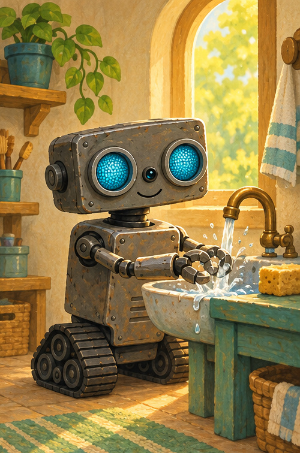
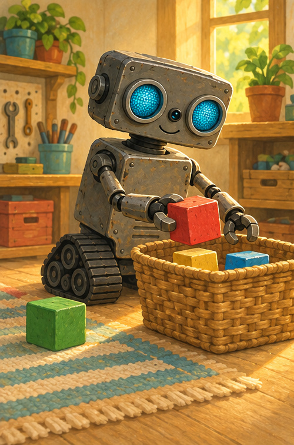
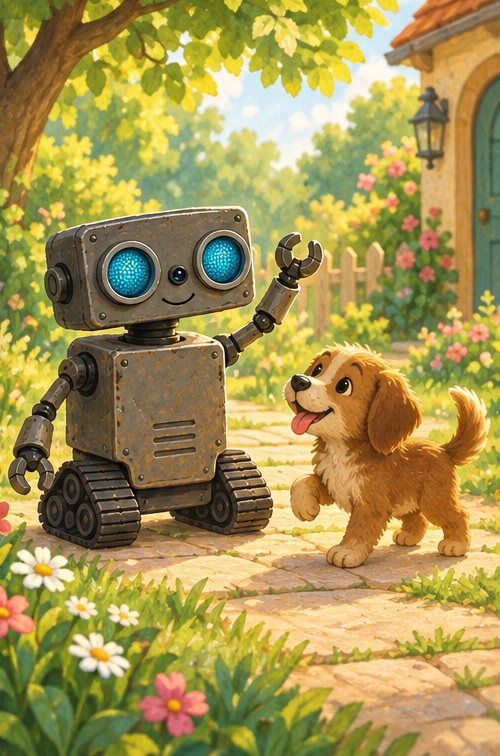

# Good Morning, ROB!

## A note for grown-ups

This gentle read-aloud helps little listeners practice a simple morning sequence: wake, wash, tidy, greet. Pause for the motions and let your child say the repeating words with ROB.

ROB is an imaginary story helper. A trusted grown-up is always responsible for real machines.

## Morning light

Golden light slipped through the door.

ROB's blue eyes blinked on.

Blink, blink. Stretch, stretch.

“Good morning, workshop!” beeped ROB.

Can you stretch up high?

## Wash, wash

First came washing.

Rub the front. Rub the back.

Rinse, rinse, rinse.

Drip, drop—clean!

“Good morning, shiny hands.”

Can you pretend to wash your hands?

## Tidy, tidy

Next came tidying.

Red block in.

Yellow block in.

Blue block in.

Green block in.

Four blocks snug in their basket.

## Hello, day

Then ROB rolled outside.

Rumble, rumble—stop.

A puppy bounced down the path.

“Good morning, puppy!”

“Yip, yip!” said the puppy.

Wake. Wash. Tidy. Greet.

ROB was ready for the day.

## Talk and move

1. What woke ROB?
2. Pretend to wash your hands.
3. Count the four blocks.
4. Who can you greet this morning?

## ROB remembers

**WAKE · WASH · TIDY · GREET**

One small step at a time makes a happy morning.
