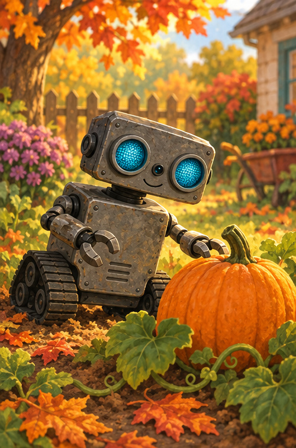
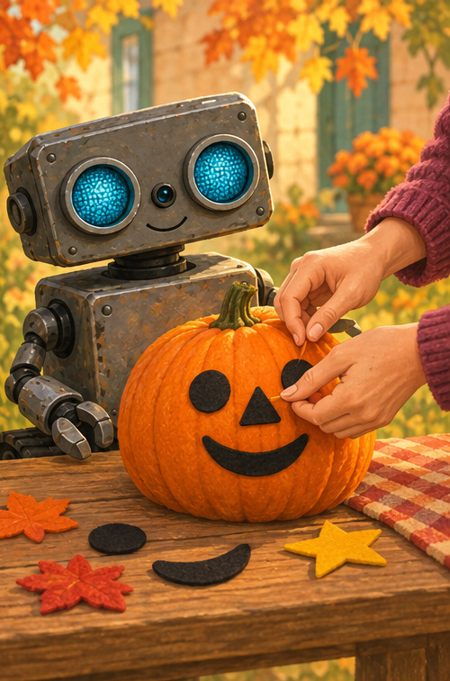
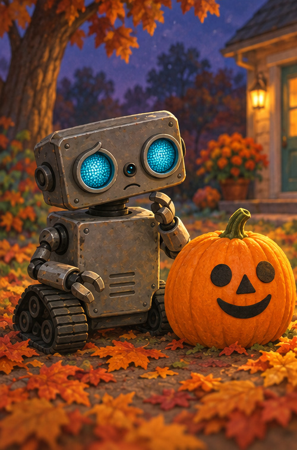
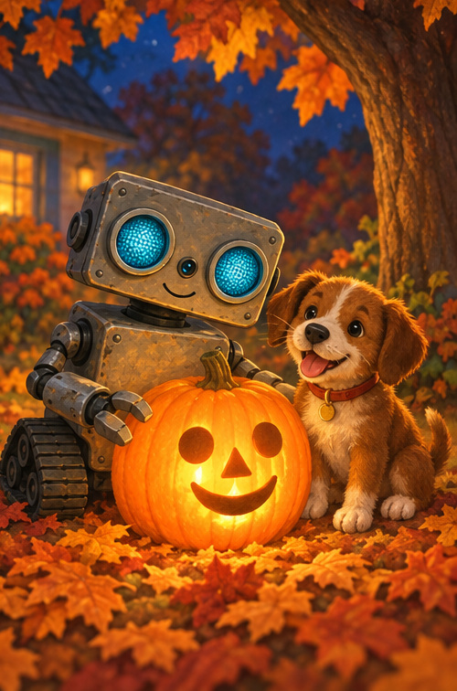

# ROB and the Friendly Pumpkin

## A note for grown-ups

This cozy, non-scary Halloween story explores circles, triangles, and feelings about the dark. ROB decorates with removable felt and uses a battery light—there is no carving, sharp tool, or open flame.

## Round and orange

ROB found something round.

Round like a ball.

Orange like a sunset.

“Hello, pumpkin!” beeped ROB.

Can you draw a round shape in the air?

## A face from shapes

With a grown-up, ROB chose soft felt shapes.

Two circle eyes.

One triangle nose.

One curved smile.

No cutting. Just press, pat, smile.

## Shadows arrive

The sky grew dark blue.

Leaves rustled. Shadows stretched.

ROB's smile turned small.

“Dark feels different,” he said.

ROB looked again. The pumpkin was still friendly.

## A gentle glow

A grown-up switched on a little battery light.

Glow went the pumpkin.

Blink went ROB's eyes.

Swish went Puppy's tail.

“Happy Halloween,” whispered ROB.

Cozy—not scary.

## Shape hunt

1. Find two circles.
2. Find one triangle.
3. Make a curved smile.
4. What helps you feel cozy in the dark?

## ROB remembers

**LOOK AGAIN · BREATHE · FIND THE FRIENDLY SHAPES**

A gentle light can make the dark feel cozy.
