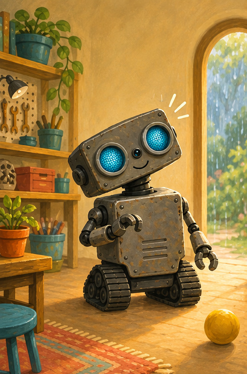
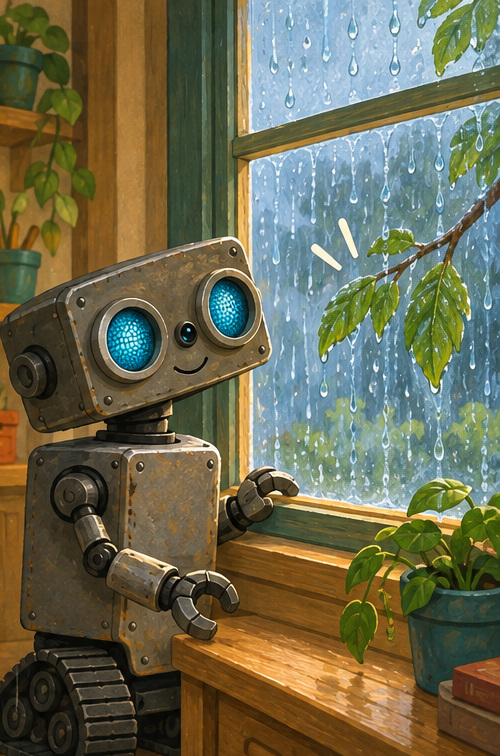
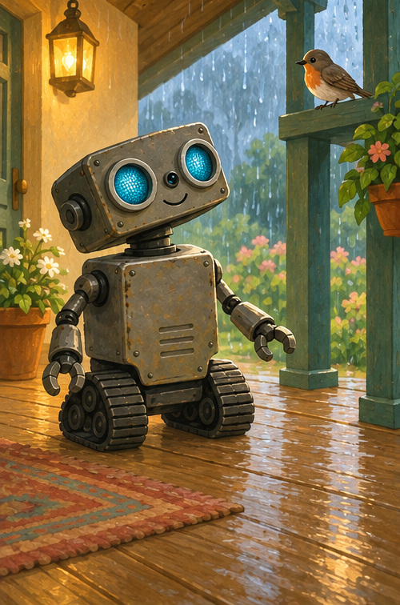
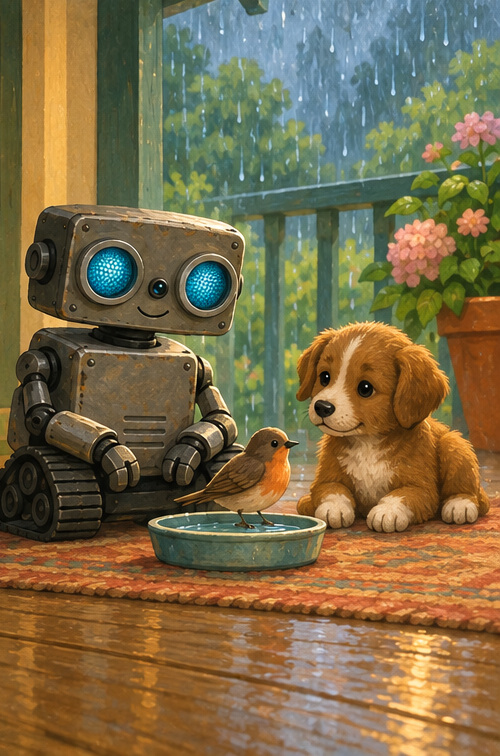

# ROB Hears a Little Sound

## A note for grown-ups

This calm listening story invites children to pause, notice, and identify everyday sounds. Make each sound softly together. Never encourage a child to investigate an unfamiliar sound without a trusted grown-up.

## Tap, tap

Tap. Tap.

ROB stopped rolling.

“What is that little sound?”

ROB made his body still.

Can you be still, too?

## Rain and branch

Drip went the rain.

Tap went the branch.

Swish went the leaves.

Drip. Tap. Swish.

ROB listened again.

## Chirp nearby

Then came a new sound.

“Chirp, chirp!”

A little bird waited under the dry porch roof.

“Hello, little singer,” said ROB.

## Quiet friends

ROB set down a shallow water dish.

The bird sipped. The puppy watched.

Nobody rushed.

Drip. Sip. Chirp.

Three friends listened together.

## Listening game

Close your eyes with a grown-up nearby.

What can you hear?

Is it loud or soft? Near or far?

## ROB remembers

**STOP · BE STILL · LISTEN**

A little sound can tell a gentle story.
