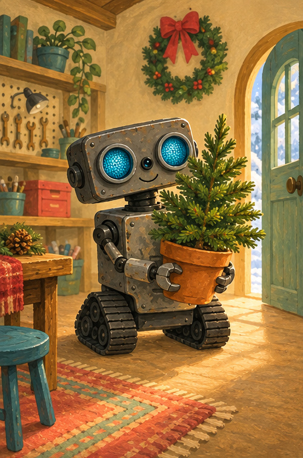
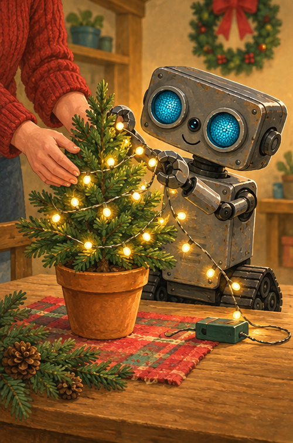

# ROB Lights the Little Tree

## A note for grown-ups

This Christmas read-aloud practices sorting colors and working together. The story uses cool battery-powered lights with grown-up supervision—never candles or an open flame.

## A little green tree

Snow sparkled outside.

ROB brought in a little green tree.

Not too tall. Not too wide.

Just right for the workshop.

“Hello, little tree,” beeped ROB.

## Sort the colors

Puppy found the ornaments.

Red in this bowl.

Gold in that bowl.

Blue in the last bowl.

Sort, sort, sort!

Which color would you choose first?

## Lights with a grown-up

A grown-up checked the cool battery lights.

ROB looped them gently.

Around once. Around twice.

Click!

The little lights began to glow.

## A star together

One gold paper star waited for the top.

ROB reached. Puppy stretched.

Together—up it went!

Red, gold, blue, and green shone in the window.

“Merry Christmas, little tree.”

## Christmas color hunt

1. Find something green.
2. Point to a red ornament.
3. Point to a blue ornament.
4. Where is the gold star?

## ROB remembers

**SORT · HELP · GLOW · SHARE**

Working together makes the season bright.
