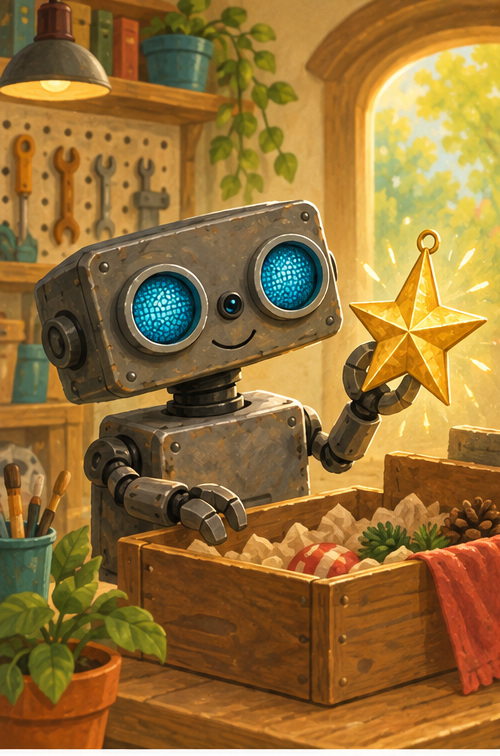
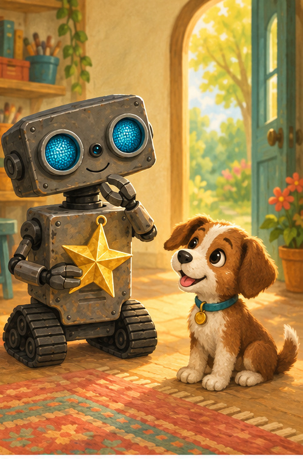
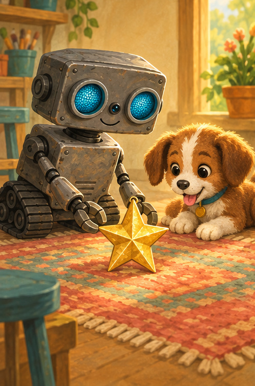
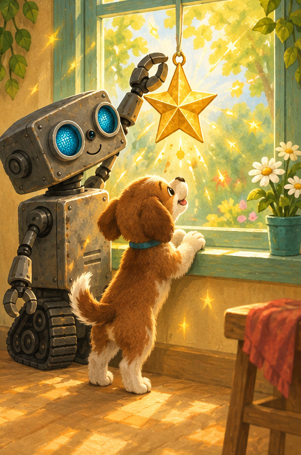

# ROB Shares the Shiny Star

## A note for grown-ups

This warm story explores wanting, waiting, and sharing. Let your child name how ROB and Puppy might feel. The star is a large decorative ornament used with grown-up supervision.

## A shiny find

ROB opened a box.

Inside was a shiny gold star.

“Oh!” beeped ROB. “I like it.”

The star twinkled in his hand.

## Puppy likes it, too

Puppy padded closer.

Puppy's eyes grew wide.

“You like it, too,” said ROB.

ROB wanted to hold the star.

Puppy wanted to see it.

What could they do?

## Room for two

ROB placed the star between them.

“We can look together.”

Puppy's tail went swish, swish.

ROB's eyes went blink, blink.

There was room for two beside the star.

## Twice as bright

Together, they hung it in the window.

Gold sparkles danced around both friends.

The star had not become smaller.

Sharing made the happy feeling bigger.

## Talk about sharing

1. How did ROB feel when he found the star?
2. How did Puppy feel?
3. What is something you can enjoy with a friend?

## ROB remembers

**LOOK · ASK · SHARE · SMILE**

Kind hearts can make one bright thing shine for two.
