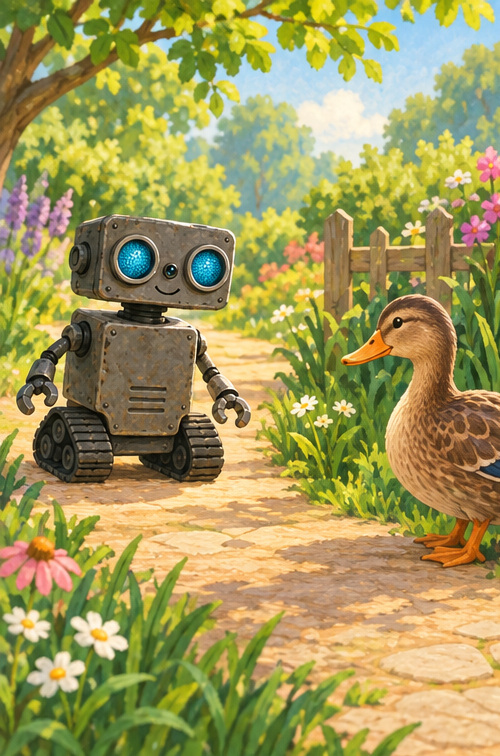
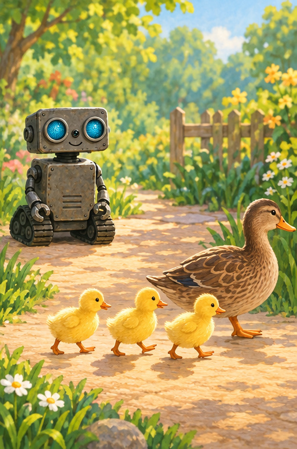
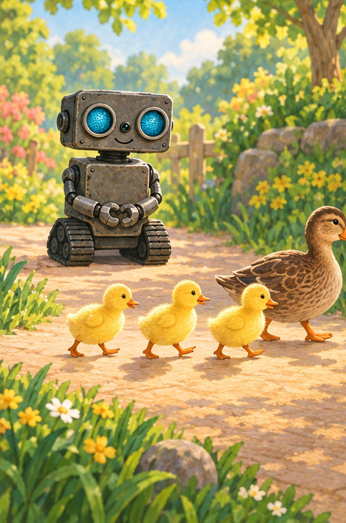
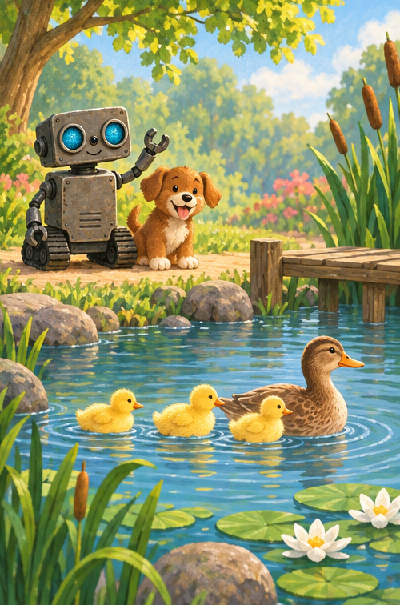

# ROB Waits for the Ducklings

## A note for grown-ups

This gentle story practices stopping and waiting when small animals cross a path. Children should watch wildlife from a safe distance with a trusted grown-up and never chase or touch it.

## Someone on the path

Rumble, rumble went ROB's treads.

Then ROB saw a mother duck.

ROB stopped far away.

“I will wait,” he said.

Can you make your feet very still?

## Three little waddles

One duckling waddled out.

Then two.

Then three.

Waddle, waddle, waddle.

ROB stayed still.

## Waiting is an action

ROB did not beep.

ROB did not roll.

ROB watched the whole little family pass.

Waiting felt slow.

Waiting kept the path safe.

## All the way across

Splash! The ducks reached the pond.

One, two, three ducklings bobbed on the water.

Puppy sat beside ROB.

“Now we may go,” said ROB.

Rumble, rumble—slowly.

## Practice waiting

Take one slow breath in.

Take one slow breath out.

Count one, two, three before you move.

## ROB remembers

**SEE · STOP · WAIT · CHECK · GO**

Waiting can be a very kind thing to do.
