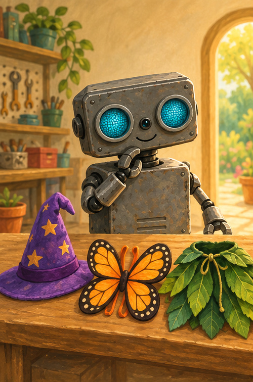
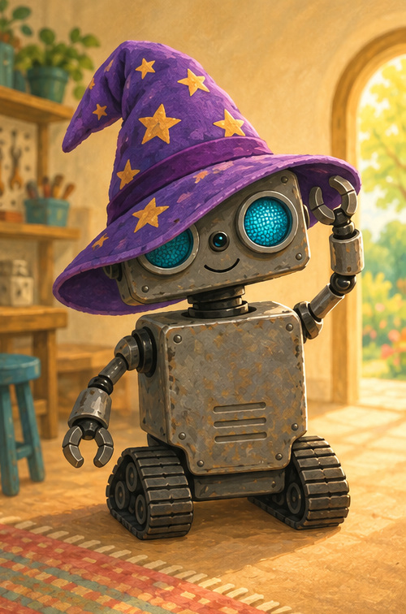
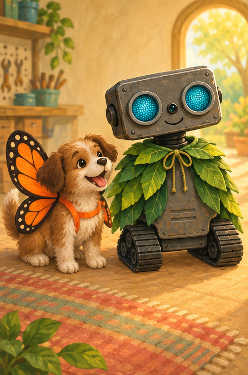
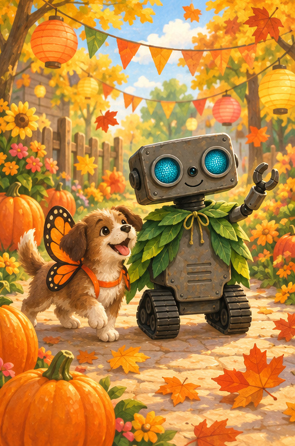

# ROB's Costume Parade

## A note for grown-ups

This playful, non-scary Halloween story celebrates choosing, trying, and changing one's mind. Keep costumes easy to see and move in, and let children decide whether they want to dress up.

## What should ROB be?

Halloween morning brought three choices.

A purple hat.

Orange butterfly wings.

A green leaf cape.

“Hmm,” beeped ROB. “What feels like me?”

## Try the hat

ROB tried the purple hat.

Flop!

It slipped over one eye.

ROB giggled. “Funny—but not today.”

It is okay to try. It is okay to change.

## Two happy choices

Puppy chose the butterfly wings.

ROB chose the leaf cape.

Swish went the cape.

Flutter went the wings.

Both friends could see. Both friends could move.

## Parade time

The garden parade began.

Rumble, flutter, swish!

No spooky monsters. No scary surprises.

Just colors, leaves, music, and friends.

“Happy Halloween!” beeped ROB.

## Pretend and play

Would you choose the hat, wings, or cape?

Pretend to flutter. Pretend to swish.

You may dress up—or simply cheer.

## ROB remembers

**CHOOSE · TRY · CHECK · CHANGE**

The best costume is one that feels good to you.
