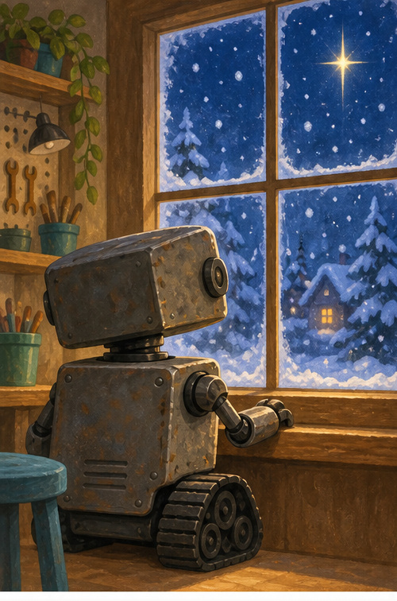
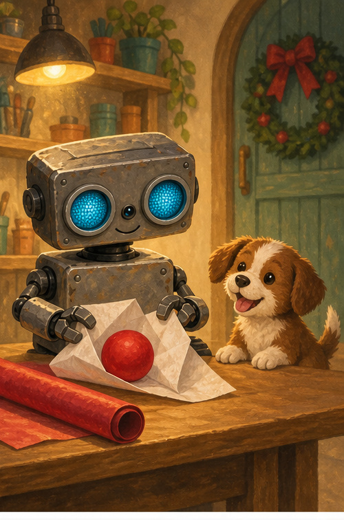
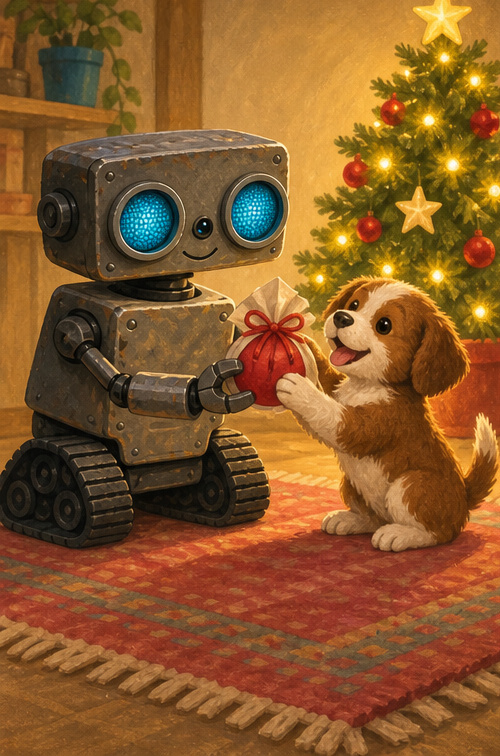
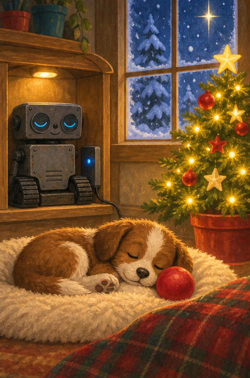

# ROB's Quiet Christmas Eve

## A note for grown-ups

This peaceful Christmas bedtime story focuses on one small gift, gratitude, and rest. Read it slowly, soften your voice on each quiet sound, and let your child say goodnight with ROB.

## Snow at the window

Snow fell without a sound.

One bright star shone above the trees.

ROB watched from the warm workshop.

“Christmas Eve is here,” he whispered.

## One little gift

ROB had one little gift for Puppy.

A red ball.

Fold went the paper.

Tuck went the corner.

Soft went the bow.

## Thank you, ROB

Puppy opened the paper.

There was the red ball!

Puppy's tail went thump, thump, thump.

“Yip!” said Puppy.

“You are welcome,” beeped ROB.

One small gift held one very big thank-you.

## Goodnight, Christmas

The tree lights glowed low.

Puppy curled around the ball.

ROB rolled to his safe charging nook.

“Goodnight, Puppy. Goodnight, tree. Goodnight, snow.”

ROB's blue eyes dimmed.

The workshop was quiet and warm.

## Say goodnight

What are you thankful for tonight?

Take one slow breath in. One slow breath out.

Say goodnight to three things you love.

## ROB remembers

**GIVE · THANK · REST**

The warmest Christmas gift is a caring heart.
