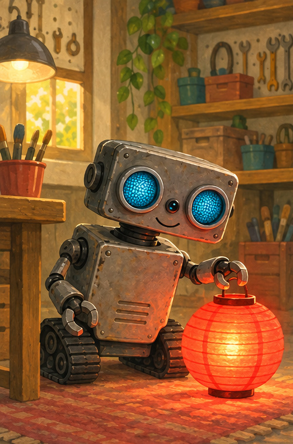
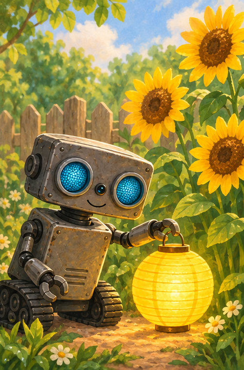
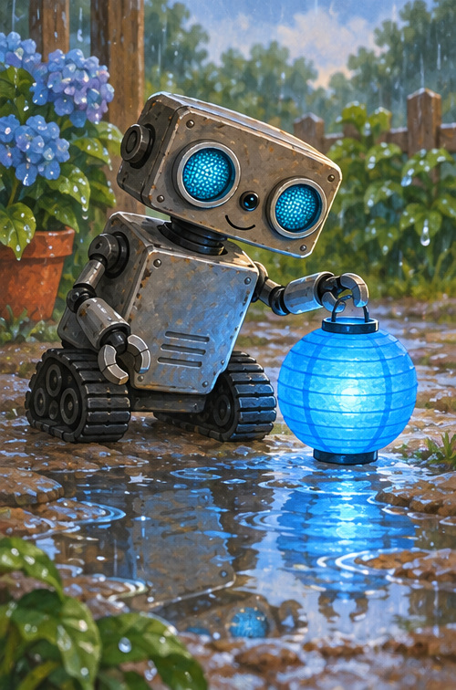
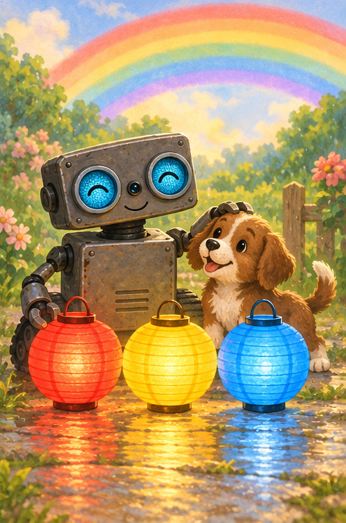

# ROB's Rainbow Lights

## A note for grown-ups

This bright read-aloud names three first colors—red, yellow, and blue—then brings them together beneath a rainbow. Ask your child to find something nearby in each color.

## Red glows warm

ROB found a lantern.

It glowed warm and bright.

“Red!” beeped ROB.

Red like a berry.

Red like a wagon.

Can you find something red?

## Yellow shines

Outside, another lantern shone.

“Yellow!” beeped ROB.

Yellow like the sun.

Yellow like the flowers.

Can you find something yellow?

## Blue cools the rain

After the rain, ROB found one more.

“Blue!” beeped ROB.

Blue like the puddle.

Blue like ROB's eyes.

Can you find something blue?

## Together they glow

Red. Yellow. Blue.

The puppy gave a happy yip.

Above them, a rainbow curved through the sky.

So many colors. One beautiful day.

## Color hunt

1. Point to the red lantern.
2. Point to the yellow lantern.
3. Point to the blue lantern.
4. What colors can you see in the rainbow?

## ROB remembers

**RED · YELLOW · BLUE**

Every color has a glow of its own.
